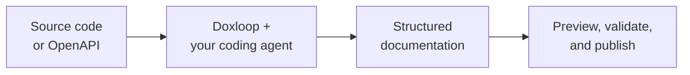

<p align="center">
  <picture>
    <source media="(prefers-color-scheme: dark)" srcset="assets/brand/doxloop-logo-dark.png">
    <source media="(prefers-color-scheme: light)" srcset="assets/brand/doxloop-logo-light.png">
    
  </picture>
</p>

<h1 align="center">Documentation your coding agent can actually ship</h1>

<p align="center">
  Turn source code or an API specification into a polished, validated documentation site<br>
  with Codex, Claude Code, or Gemini.
</p>

<p align="center">
  <a href="https://www.npmjs.com/package/@doxbrix/doxloop"></a>
  <a href="https://nodejs.org"></a>
  <a href="./LICENSE"></a>
</p>

<p align="center">
  <a href="#quickstart">Quickstart</a> ·
  <a href="#real-examples">Real examples</a> ·
  <a href="#use-doxloop-in-vs-code-codex-or-claude">Editor and agent apps</a> ·
  <a href="#everyday-workflow">Commands</a> ·
  <a href="#guides">Guides</a>
</p>



Doxloop gives your coding agent a repeatable documentation workflow: inspect
the source, identify the audience, plan the content, write generator-native
pages, build navigation, and validate the result. Your product source stays
separate from the generated documentation project.

## Quickstart

### 1. Install

Requires Node.js 20.12 or later.

```bash
npm install --global @doxbrix/doxloop
```

### 2. Generate

Run this from your product directory:

```bash
doxloop create \
  --source . \
  --output ../my-docs \
  "Create developer documentation with a quickstart and API reference."
```

Doxloop automatically starts the first supported agent it finds. Choose one
explicitly with `--agent codex`, `--agent claude`, or `--agent gemini`.

### 3. Preview and validate

```bash
cd ../my-docs
doxloop preview --open
doxloop test
```

Your source and docs remain separate:

```text
workspace/
├── my-product/  ← read-only source evidence
└── my-docs/     ← editable and deployable documentation
```

## Real examples

### Lodash developer docs from the CLI

This command was run from the
[Lodash](https://github.com/lodash/lodash) source directory:

```bash
doxloop create \
  --source . \
  --output ../lodash-docs \
  --agent claude \
  --model claude-sonnet-5 \
  "Create documentation for developers for this utility library. Include a quickstart and also include class and function API reference for the developers and simplified example of each function."
```

**Generated documentation:** <https://apps-lodash-docs.sites.doxbrix.com/>

### Petstore API docs from VS Code with Codex

First, initialize a documentation project and open it in VS Code:

```bash
doxloop init petstore-docs
code petstore-docs
```

Then give Codex this prompt:

> Using Doxloop authoring, create API documentation for this OpenAPI document:
> https://petstore3.swagger.io/api/v3/openapi.json

Because `doxloop init` installs the Doxloop authoring skills inside the project,
Codex can inspect the OpenAPI document and create the pages, endpoint reference,
examples, and navigation directly in the opened folder.

**Generated documentation:** <https://apps-pet-store.sites.doxbrix.com/>

When it finishes:

```bash
cd petstore-docs
doxloop preview --open
doxloop test
```

## Use Doxloop in VS Code, Codex, or Claude

Prefer working in Visual Studio Code, the Codex app, Claude Code, or another
local agent experience? Initialize the project first:

```bash
doxloop init my-docs --source product=../my-product
```

Then open the generated folder where you want to work:

| Where | Open the project |
| --- | --- |
| VS Code with Codex | `code my-docs` |
| Codex app | Open the `my-docs` folder |
| Claude Code | `cd my-docs && claude` |

Ask the agent to use Doxloop authoring:

```text
Use Doxloop authoring to create developer documentation for this project.
Start with a five-minute quickstart, then add task guides and API reference.
```

`doxloop init` installs project-local skills for the supported agent
ecosystems:

| Agent experience | Installed skills |
| --- | --- |
| Codex and Gemini | `.agents/skills/` |
| Claude Code | `.claude/skills/` |

If an editor does not load project skills automatically, prepare a complete
prompt and paste it into the agent session:

```bash
doxloop create --print \
  "Create developer documentation with a quickstart and API reference."
```

> `--print` cannot record when the external agent finishes. Use a
> Doxloop-launched CLI agent when automatic source-change tracking is important.

## What Doxloop handles

| Capability | What you get |
| --- | --- |
| 🔎 **Source-grounded research** | Uses code, public interfaces, tests, examples, and configuration as evidence. |
| 🧭 **Documentation planning** | Identifies readers, important workflows, page coverage, and navigation before writing. |
| ✍️ **Generator-native output** | Creates the right Markdown, MDX, configuration, components, and theme for the selected generator. |
| ✅ **Built-in quality checks** | Validates pages, navigation, links, metadata, code fences, and generator conventions. |
| 🔄 **Focused updates** | Tracks the source revision and directs the agent to documentation affected by product changes. |
| 🔐 **Local-first control** | Keeps authoring, validation, and preview local; publishing is always a separate command. |

## Everyday workflow

| Goal | Command |
| --- | --- |
| Create a docs project | `doxloop init my-docs` |
| Generate documentation | `doxloop create "Describe what you need"` |
| Update docs after code changes | `doxloop update` |
| Run a read-only quality review | `doxloop review` |
| Preview locally | `doxloop preview --open` |
| Validate the project | `doxloop test` |
| Check setup and agent readiness | `doxloop doctor` |
| See project status | `doxloop status` |

Run `doxloop <command> --help` for every option.

### Choose an agent or model

```bash
doxloop create --agent codex --reasoning high
doxloop create --agent claude --model <model-name>
doxloop create --agent gemini
```

### Ask for exactly what you need

```bash
doxloop create \
  "Write for platform engineers. Include installation, Kubernetes deployment, authentication, a production-readiness checklist, and troubleshooting."
```

```bash
doxloop update \
  "Document webhook retries and remove the legacy import workflow."
```

You can describe the audience, desired outcomes, required pages, tone,
priorities, or exclusions in plain language.

## Preview, test, and publish

Authoring never publishes automatically.

```bash
doxloop status
doxloop test
doxloop preview --open
```

To deploy through [Doxbrix](https://www.doxbrix.com/):

```bash
doxloop login
doxloop deploy --dry-run
doxloop deploy
```

Deployments are private by default. To make the site accessible to anyone, run
`doxloop deploy --public` and confirm the public-access warning.

## Supported generators

Doxbrix is built in and selected by default. External generators use a separate
adapter package, so each documentation project installs only what it needs.

| Generator | Package | Source format | Build output |
| --- | --- | --- | --- |
| **Doxbrix** | Included | Markdown and Doxbrix MDX | Doxbrix bundle |
| Docusaurus | `@doxbrix/doxloop-generator-docusaurus` | Markdown and MDX | `build/` |
| MkDocs Material | `@doxbrix/doxloop-generator-mkdocs` | Material Markdown | `site/` |
| Sphinx | `@doxbrix/doxloop-generator-sphinx` | reStructuredText | `_build/html/` |
| Hugo | `@doxbrix/doxloop-generator-hugo` | Markdown | `public/` |
| VitePress | `@doxbrix/doxloop-generator-vitepress` | Markdown | `docs/.vitepress/dist/` |
| Markdoc | `@doxbrix/doxloop-generator-markdoc` | Markdoc | `dist/` |
| Nextra | `@doxbrix/doxloop-generator-nextra` | MDX | `out/` |
| Starlight | `@doxbrix/doxloop-generator-starlight` | Markdown and MDX | `dist/` |
| Jekyll | `@doxbrix/doxloop-generator-jekyll` | Markdown and Liquid | `_site/` |
| Static HTML | `@doxbrix/doxloop-generator-static` | HTML | `site/` |

Pass `--generator <name>` to `doxloop init` to select one. Doxbrix needs no
extra installation; install an external generator's adapter package before
initializing its project. The
[public generator guide](https://doxloop.sites.doxbrix.com/generators) covers
installation, selection, inspection, removal, and migration.

## Guides

| Author and maintain | Configure and extend | Operate safely |
| --- | --- | --- |
| [Create documentation](https://doxloop.sites.doxbrix.com/create) | [Project configuration](https://doxloop.sites.doxbrix.com/project-configuration) | [Troubleshooting](https://doxloop.sites.doxbrix.com/troubleshooting) |
| [Update documentation](https://doxloop.sites.doxbrix.com/update) | [Generators](https://doxloop.sites.doxbrix.com/generators) | [Security](https://doxloop.sites.doxbrix.com/security) |
| [Agent compatibility](https://doxloop.sites.doxbrix.com/agent-compatibility) | [CLI reference](https://doxloop.sites.doxbrix.com/cli) | [CI and automation](https://doxloop.sites.doxbrix.com/ci-automation) |
| [Review documentation](https://doxloop.sites.doxbrix.com/review) | [Guide screenshots](https://doxloop.sites.doxbrix.com/guide-screenshots) | [Publish documentation](https://doxloop.sites.doxbrix.com/publish) |

Browse all documentation at <https://doxloop.sites.doxbrix.com/>.

## License

[Doxloop Proprietary Software License](./LICENSE). You may download, install,
and run unmodified copies for lawful personal or commercial purposes. Copying,
modification, incorporation into other products, and redistribution are not
permitted without explicit written permission from Doxbrix.
