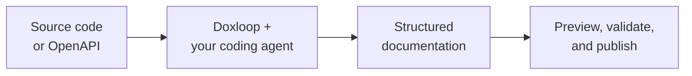

<p align="center">
  <picture>
    <source media="(prefers-color-scheme: dark)" srcset="assets/brand/doxloop-logo-dark.png">
    <source media="(prefers-color-scheme: light)" srcset="assets/brand/doxloop-logo-light.png">
    
  </picture>
</p>

<h1 align="center">Documentation your coding agent can actually ship</h1>

<p align="center">
  Turn source code or an API specification into a polished, validated documentation site<br>
  with Codex, Claude Code, or Gemini.
</p>

<p align="center">
  <a href="https://www.npmjs.com/package/@doxbrix/doxloop"></a>
  <a href="https://nodejs.org"></a>
  <a href="./LICENSE"></a>
</p>

<p align="center">
  <a href="#quickstart">Quickstart</a> ·
  <a href="#real-examples">Real examples</a> ·
  <a href="#use-doxloop-in-vs-code-codex-or-claude">Editor and agent apps</a> ·
  <a href="#automatic-documentation-sync">Automatic sync</a> ·
  <a href="#everyday-workflow">Commands</a> ·
  <a href="#guides">Guides</a>
</p>



Doxloop gives your coding agent a repeatable documentation workflow: inspect
the source, identify the audience, plan the content, write generator-native
pages, build navigation, and validate the result. Your product source stays
separate from the generated documentation project.

## Quickstart

### 1. Install

Requires Node.js 20.12 or later.

```bash
npm install --global @doxbrix/doxloop
```

### 2. Set up the documentation project

Run this from your product directory:

```bash
doxloop init
```

Doxloop detects the product repository and guides you through the project
location, product evidence, site title, and generator. It shows a complete
summary before creating anything. Product code and documentation are kept in
separate sibling directories.

Documenting an API without a product checkout? Run the same command in the
directory where you want to work, then choose **API specification** and enter
the OpenAPI file or URL when asked.

### 3. Create the documentation

```bash
cd ../my-product-docs
doxloop create
```

`create` asks what readers need and which agent to use, shows all supported
choices, and automatically installs Codex, Claude Code, or Gemini with npm when
you select a missing agent. It shows an authoring summary and starts the agent
only after confirmation. Press Enter at the documentation request to let the
agent recommend a complete, evidence-backed plan.

### 4. Preview and validate

```bash
doxloop preview --open
doxloop test
```

Your source and docs remain separate:

```text
workspace/
├── my-product/       ← read-only source evidence
└── my-product-docs/  ← editable and deployable documentation
```

From then on, the everyday workflow is deliberately short:

```bash
doxloop update
doxloop deploy
doxloop settings
```

No configuration flags are required for interactive use. Advanced flags remain
available as optional one-run overrides for scripts and CI.

## Real examples

### Lodash developer docs from the CLI

From the [Lodash](https://github.com/lodash/lodash) source directory:

```bash
doxloop init
cd ../lodash-docs
doxloop create
```

At the `create` prompt, request developer documentation with a quickstart,
class and function reference, and a simple example for every function. Choose
Claude Code when Doxloop asks which agent to use. If it is missing, Doxloop
installs it before the run. That choice can be remembered for later updates.

**Generated documentation:** <https://apps-lodash-docs.sites.doxbrix.com/>

### Petstore API docs from VS Code with Codex

First, initialize a documentation project. Use `petstore-docs` as the project
directory, choose **API specification**, and enter
`https://petstore3.swagger.io/api/v3/openapi.json` when asked:

```bash
doxloop init
cd petstore-docs
code .
```

Then give Codex this prompt:

> Using Doxloop authoring, create API documentation for this OpenAPI document:
> https://petstore3.swagger.io/api/v3/openapi.json

Because `doxloop init` installs the Doxloop authoring skills inside the project,
Codex can inspect the OpenAPI document and create the pages, endpoint reference,
examples, and navigation directly in the opened folder.

**Generated documentation:** <https://apps-pet-store.sites.doxbrix.com/>

When it finishes:

Run `doxloop preview --open` and `doxloop test` when it finishes.

## Use Doxloop in VS Code, Codex, or Claude

Prefer working in Visual Studio Code, the Codex app, Claude Code, or another
local agent experience? Initialize the project first:

```bash
doxloop init
```

Then open the generated folder where you want to work:

| Where | Open the project |
| --- | --- |
| VS Code with Codex | `code ../my-product-docs` |
| Codex app | Open the generated documentation folder |
| Claude Code | `cd ../my-product-docs && claude` |

Ask the agent to use Doxloop authoring:

```text
Use Doxloop authoring to create developer documentation for this project.
Start with a five-minute quickstart, then add task guides and API reference.
```

`doxloop init` installs project-local skills for the supported agent
ecosystems:

| Agent experience | Installed skills |
| --- | --- |
| Codex and Gemini | `.agents/skills/` |
| Claude Code | `.claude/skills/` |

If an editor does not load project skills automatically, prepare a complete
prompt and paste it into the agent session:

```bash
doxloop create --print \
  "Create developer documentation with a quickstart and API reference."
```

> `--print` cannot record when the external agent finishes. Use a
> Doxloop-launched CLI agent when automatic source-change tracking is important.

## What Doxloop handles

| Capability | What you get |
| --- | --- |
| 🔎 **Source-grounded research** | Uses code, public interfaces, tests, examples, and configuration as evidence. |
| 🧭 **Documentation planning** | Identifies readers, important workflows, page coverage, and navigation before writing. |
| ✍️ **Generator-native output** | Creates the right Markdown, MDX, configuration, components, and theme for the selected generator. |
| ✅ **Built-in quality checks** | Validates pages, navigation, links, metadata, code fences, and generator conventions. |
| 🔄 **Focused updates** | Tracks the source revision and directs the agent to documentation affected by product changes. |
| 🚨 **Drift detection** | `doxloop check` names the pages a source change made stale, without starting an agent or using a model. |
| ⚙️ **Automatic sync** | Polls source-provider APIs on a local schedule, generates isolated validated proposals, then applies only what a user accepts. |
| 🖥️ **Local control center** | Runs project setup, sources, authoring, monitoring, review, validation, preview, and publishing from one loopback-only UI. |
| 🔐 **Local-first control** | Keeps authoring, validation, and preview local; publishing is always a separate command. |

## Everyday workflow

| Goal | Command |
| --- | --- |
| Open the complete local UI | `doxloop ui` |
| Create a docs project | `doxloop init` |
| Generate documentation | `doxloop create` |
| See which pages the product outgrew | `doxloop check` |
| Configure automatic documentation sync | `doxloop sync setup` |
| Verify automatic sync is ready | `doxloop sync status` |
| Run one synchronization cycle | `doxloop sync now` |
| List every generated review run | `doxloop sync history` |
| Compare current and proposed pages side by side | `doxloop sync review --open` |
| Disable automatic sync cleanly | `doxloop sync off` |
| Update docs after code changes | `doxloop update` |
| View or change project settings | `doxloop settings` |
| Run a read-only quality review | `doxloop review` |
| Preview locally | `doxloop preview --open` |
| Validate the project | `doxloop test` |
| Check setup and agent readiness | `doxloop doctor` |
| See project status | `doxloop status` |
| Deploy using saved settings | `doxloop deploy` |

Run `doxloop <command> --help` for every option.

### Use the local control center

Run this from a Doxloop project—or from the parent directory where you want to
create one:

```bash
doxloop ui
```

The command opens a loopback-only server on `http://127.0.0.1:4317`. Use
`--no-open` to start it without opening a browser, `--port` to choose another
local port, or `--page` to deep-link to `sources`, `authoring`, `sync`,
`proposals`, `quality`, `preview`, `publish`, or `settings`.

The control center provides the same safeguards as the CLI: product evidence is
read-only, authoring jobs are cancellable, proposals remain isolated until
accepted, deployment is a separate confirmed action, and credentials are never
sent to the browser. It covers:

- new-project setup and generator selection;
- local directories, OpenAPI specifications, and tested GitHub remotes;
- create, update, and review runs with agent, model, reasoning, and screenshot controls;
- source-monitoring schedules, scope, budgets, live status, and manual runs;
- rendered and source proposal diffs with hunk, page, and whole-proposal acceptance;
- validation, environment diagnostics, preview, account sign-in, dry runs, and deployment; and
- documentation standards, design references, application capture settings, agents, skills, and generator packages.

`doxloop sync review --open` remains a convenient deep link: it opens the same
server directly on the Proposals page.

### Change project settings

Use one settings command instead of editing `.doxloop/project.json` or
remembering configuration flags:

```bash
doxloop settings
```

The interactive settings menu manages:

- product source directories and OpenAPI specifications;
- the site title and default authoring agent;
- audience, locale, tone, and reader outcomes;
- design references and application screenshot behavior; and
- hosted project name, slug, visibility, and Doxbrix destination.

Generator changes are intentionally not performed in place because changing
frameworks can overwrite generator-native files. Create a new project with
`doxloop init` when migrating generators.

### Optional automation overrides

Interactive users do not need flags. Scripts can still override saved settings
for one run:

```bash
doxloop create --agent codex --reasoning high
doxloop create --agent claude --model <model-name>
doxloop create --agent gemini
```

### Ask for exactly what you need

```bash
doxloop create \
  "Write for platform engineers. Include installation, Kubernetes deployment, authentication, a production-readiness checklist, and troubleshooting."
```

```bash
doxloop update \
  "Document webhook retries and remove the legacy import workflow."
```

You can describe the audience, desired outcomes, required pages, tone,
priorities, or exclusions in plain language.

## Keep documentation current

Documentation goes stale because nothing reports it. `doxloop check` answers
that question in milliseconds:

```bash
doxloop check
```

```text
Documentation drift: 2 pages stale

  guides/authentication.md
    stale because  src/auth.ts changed (9f2c1ab)
    last verified  2026-06-14

  reference/payments.md
    stale because  src/routes/pay.ts changed (9f2c1ab)

  18 other tracked pages current

Fix with: doxloop update
```

It names individual pages because each authoring run records the sources behind
every page in `.doxloop/evidence-map.json`. No agent starts, no model is used,
and no credentials are needed, so `check` is safe to run on every commit or in
continuous integration. It exits `1` when pages are stale.

Tune what counts as a documentation-relevant change in `.doxloop/project.json`:

```json
"sync": {
  "watch": ["src/**", "openapi.yaml"],
  "ignore": ["**/*.test.ts", "pnpm-lock.yaml"]
}
```

Lock files and snapshots are ignored by default. Test files are not: the
authoring workflow reads tests as evidence of supported behavior, so a changed
test can legitimately change documentation.

## Automatic documentation sync

Automatic sync polls the source repository through a read-only provider API,
then uses the coding agent already signed in on your machine when documentation
needs a proposal. It never installs source-repository hooks, needs a model API
key, writes to the source repository, or publishes documentation.

The complete lifecycle is six commands:

| Command | Purpose |
| --- | --- |
| `doxloop sync setup` | Ask three questions, save the policy, and install a local scheduled API check. |
| `doxloop sync status` | Verify the remote source, scheduler health, agent sign-in, evidence map, last run, and current drift. |
| `doxloop sync now` | Check immediately and generate an isolated proposal when documentation is stale. Current documentation is a no-op. |
| `doxloop sync history` | List every run with its trigger, status, file count, and accepted-change count. |
| `doxloop sync review --open` | Open the unified local control center directly on Proposals, with rendered and source comparisons. |
| `doxloop sync off` | Remove the schedule while keeping the saved settings for later reuse. |

### Set it up

First add a read-only `remote` to each directory source in
`.doxloop/project.json`; see the [project format](docs/project-format.md).
Private GitHub repositories use the environment variable named by `tokenEnv`
(default `GITHUB_TOKEN`). The token is read at runtime and never saved by
Doxloop.

```bash
doxloop sync setup
```

Three questions — which product branch to follow, when to look for drift, and
what to do when pages are stale — then Doxloop shows a summary before changing
anything.

For scripts or repeatable setup, provide all three answers directly:

```bash
doxloop sync setup \
  --branch main \
  --on every@15m \
  --mode propose
```

Choose what happens when drift is found:

| Mode | Behavior when documentation is stale |
| --- | --- |
| `check` | Report the affected pages. No agent, model, credentials, documentation writes, or commits. |
| `propose` | Run the signed-in coding agent in an isolated workspace and create a validated review run. |
| `auto` | Automatically generate the same isolated review run whenever a configured trigger finds drift. |

Neither authoring mode changes the real documentation before approval. The
documentation directory does not need to be a Git repository.

Choose when the policy runs:

| Trigger | Installed behavior |
| --- | --- |
| `every@Nm` | Poll the provider API every N minutes, for example `every@15m`. |
| `every@Nh` | Poll the provider API every N hours, for example `every@2h`. |
| `daily@HH:MM` | A local OS job using launchd, systemd/cron, or Windows Task Scheduler. |
| `manual` | No automatic trigger; run `doxloop sync now` yourself. |

Scheduled checks compare the documented commit with the provider's branch head.
When it changed, Doxloop asks the provider for the changed-file list and
downloads that exact commit into `.doxloop/cache` as isolated evidence. It never
clones, fetches, commits, pushes, or changes hooks in the user's source checkout.

Scheduled authoring uses the coding agent already signed in on the local
machine. On macOS, setup smoke-tests a new LaunchAgent in the real scheduler
context before reporting success, including whether the background process can
find the agent. Other platforms verify that their native schedule was installed.

### Verify it before depending on it

```bash
doxloop sync status
```

Status checks more than whether files exist. It verifies each configured remote,
the native scheduler registration, the followed source branch, agent
authentication when needed, evidence-map coverage, the last sync log entry, and
live drift. On macOS it also reports the LaunchAgent's running state and last
exit result, so a failed or never-verified schedule is not presented as ready.

### Run one cycle or turn it off

```bash
doxloop sync now
doxloop sync history
doxloop sync review --open
doxloop sync off
```

Every cycle checks first. If the documentation is current, it records a quiet
no-op and does not start an agent. If it is stale, the agent edits a staged copy
and the actual documentation remains unchanged.

The Proposals page keeps the full review in one workspace:

1. The run list shows what is waiting, why it was drafted, and its decision status.
2. Page tabs switch between every documentation and supporting-file change.
3. Rendered comparison supports side-by-side or stacked layouts and can fold
   unchanged content; source comparison shows line-level context and per-hunk acceptance.
4. Actions accept one hunk, one page, or the whole proposal, or reject the proposal.

The main UI sections have stable URLs for direct links. Proposal view controls
switch the comparison between side by side and stacked, hide everything except
the changes, or open the **source diff** — the line-by-line change with
surrounding context, differing words emphasized, and an Accept button on each
individual change.

Acceptance works at three levels: one highlighted change in the source diff,
every change on one page, or the complete proposal. Supporting files such as the
evidence map are written automatically once every page has been accepted.

Every accepted selection is checked against the original file fingerprint and
validated before it is written. A local edit made while review is pending causes
a visible conflict instead of an overwrite. Partial acceptance applies only the
selected hunks and keeps the run pending; the synchronization baseline advances
only after the complete proposal is accepted. Rejected proposals never change
the documentation.

Authoring also skips when the optional daily run budget is exhausted. Advanced guardrails such as
`sync.budget.maxRunsPerDay` and `sync.budget.maxMinutes` can be set in
`.doxloop/project.json`; setup manages the common branch, mode, and trigger
settings.

`sync off` removes the registered schedule but retains the rest of the sync
policy and remote configuration so setup can be run again.

## Preview, test, and publish

Authoring never publishes automatically.

```bash
doxloop status
doxloop test
doxloop preview --open
```

To deploy through [Doxbrix](https://www.doxbrix.com/):

```bash
doxloop deploy
```

`deploy` validates the documentation, shows the exact name, slug, destination,
visibility, page count, and warnings, then asks once before uploading. It offers
sign-in after you approve the summary. Deployments are private by default.

Use `doxloop settings` to change visibility or the hosted address. A public
deployment always shows a default-no warning in an interactive terminal. For
CI, the explicit combination `doxloop deploy --public --yes` runs without
prompts.

## Supported generators

Doxbrix is built in and selected by default. External generators use a separate
adapter package, so each documentation project installs only what it needs.

| Generator | Package | Source format | Build output |
| --- | --- | --- | --- |
| **Doxbrix** | Included | Markdown and Doxbrix MDX | Doxbrix bundle |
| Docusaurus | `@doxbrix/doxloop-generator-docusaurus` | Markdown and MDX | `build/` |
| MkDocs Material | `@doxbrix/doxloop-generator-mkdocs` | Material Markdown | `site/` |
| Sphinx | `@doxbrix/doxloop-generator-sphinx` | reStructuredText | `_build/html/` |
| Hugo | `@doxbrix/doxloop-generator-hugo` | Markdown | `public/` |
| VitePress | `@doxbrix/doxloop-generator-vitepress` | Markdown | `docs/.vitepress/dist/` |
| Markdoc | `@doxbrix/doxloop-generator-markdoc` | Markdoc | `dist/` |
| Nextra | `@doxbrix/doxloop-generator-nextra` | MDX | `out/` |
| Starlight | `@doxbrix/doxloop-generator-starlight` | Markdown and MDX | `dist/` |
| Jekyll | `@doxbrix/doxloop-generator-jekyll` | Markdown and Liquid | `_site/` |
| Static HTML | `@doxbrix/doxloop-generator-static` | HTML | `site/` |

Choose a generator during `doxloop init`. Doxbrix is the recommended first
choice and needs no extra installation. Selecting another framework opens a
second list and Doxloop offers to install its adapter package. The
[public generator guide](https://doxloop.sites.doxbrix.com/generators) covers
installation, selection, inspection, removal, and migration.

## Guides

| Author and maintain | Configure and extend | Operate safely |
| --- | --- | --- |
| [Create documentation](https://doxloop.sites.doxbrix.com/create) | [Project configuration](https://doxloop.sites.doxbrix.com/project-configuration) | [Troubleshooting](https://doxloop.sites.doxbrix.com/troubleshooting) |
| [Update documentation](https://doxloop.sites.doxbrix.com/update) | [Generators](https://doxloop.sites.doxbrix.com/generators) | [Security](https://doxloop.sites.doxbrix.com/security) |
| [Agent compatibility](https://doxloop.sites.doxbrix.com/agent-compatibility) | [CLI reference](https://doxloop.sites.doxbrix.com/cli) | [CI and automation](https://doxloop.sites.doxbrix.com/ci-automation) |
| [Review documentation](https://doxloop.sites.doxbrix.com/review) | [Guide screenshots](https://doxloop.sites.doxbrix.com/guide-screenshots) | [Publish documentation](https://doxloop.sites.doxbrix.com/publish) |

Browse all documentation at <https://doxloop.sites.doxbrix.com/>.

## License

[Doxloop Proprietary Software License](./LICENSE). You may download, install,
and run unmodified copies for lawful personal or commercial purposes. Copying,
modification, incorporation into other products, and redistribution are not
permitted without explicit written permission from Doxbrix.
