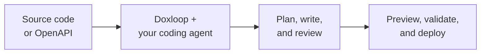

<p align="center">
  <picture>
    <source media="(prefers-color-scheme: dark)" srcset="assets/brand/doxloop-logo-dark.png">
    <source media="(prefers-color-scheme: light)" srcset="assets/brand/doxloop-logo-light.png">
    
  </picture>
</p>

<h1 align="center">Documentation your coding agent can actually ship</h1>

<p align="center">
  Turn source code or an API specification into a polished, validated documentation site<br>
  with Codex, Claude Code, or Gemini, from one local control center.
</p>

<p align="center">
  <a href="https://www.npmjs.com/package/@doxbrix/doxloop"></a>
  <a href="https://nodejs.org"></a>
  <a href="./LICENSE"></a>
</p>

<p align="center">
  <a href="#quickstart">Quickstart</a> ·
  <a href="#real-examples">Real examples</a> ·
  <a href="#the-workspace">The workspace</a> ·
  <a href="#keep-documentation-current">Monitoring</a> ·
  <a href="#review-what-changed-and-why">Review</a> ·
  <a href="#guides">Guides</a>
</p>



Doxloop is a local, browser-based control center for documentation. You connect
the sources that describe your product, describe what readers should be able to
do, and approve a documentation plan. Your coding agent researches the evidence
and writes generator-native pages into an isolated proposal. You review every
change, accept what is right, preview the site, and deploy it, all from the same
window. Product source stays read-only and separate from the documentation
project.

## Quickstart

### 1. Install

Doxloop requires Node.js 22.13 or later.

```bash
npm install --global @doxbrix/doxloop
```

### 2. Open the control center

Open a terminal in the folder where you want the documentation project to be
created. That is usually the parent folder of your product checkout, so the
product and its documentation become sibling directories. Then start Doxloop:

```bash
doxloop ui
```

This is the only command you need. It starts a loopback-only server on
`http://127.0.0.1:4317` and opens your browser. Everything else happens in the
browser. When no documentation project exists yet, Doxloop opens the setup
wizard. When one exists, it opens the workspace for that project.

### 3. Set up the workspace

The wizard walks through five steps and creates nothing until the last one.

1. **Workspace.** Enter a folder name for the documentation project and the
   title readers will see.
2. **Sources.** Choose **Add source**, then **Source code** for a local folder
   or a Git repository, or **OpenAPI spec** to upload a file or paste a public
   URL. Private repositories accept a username and a personal access token that
   is held in memory for the session and never written to the project.
3. **Tools.** Pick the documentation generator (Doxbrix is recommended and
   needs no installation), the coding assistant (Codex, Claude Code, or
   Gemini), and optionally the model. If the assistant is not installed,
   Doxloop installs it for you. Answer **Add product screenshots?** to let
   Doxloop capture images from a running local or test application.
4. **Guidance.** Describe what readers should be able to do, choose the
   documentation depth (Comprehensive is recommended; the page count comes
   from your sources, not from the depth), add audiences, and open **Advanced
   planning preferences** for examples, locale, terminology, exclusions,
   accessibility target, and how the planner should handle questions.
5. **Review.** Check the summary and choose **Create documentation plan**.

Doxloop then downloads read-only snapshots of any remote sources, installs the
project-local authoring skills for the selected assistant, and starts a
read-only planning run. The planner researches your sources and proposes a
page structure. Nothing is written until you approve it.

### 4. Approve the plan and generate

The plan opens on the **Create** page. Answer anything under **Needs your
decision**, adjust the **Documentation brief**, and edit the **Documentation
structure**: add, reorder, remove, or defer pages, and open any page to change
its purpose, priority, section, or screenshot treatment. Ask for changes in
plain language under **Want to change the plan?** and a new plan version comes
back. When it looks right, choose **Approve & generate**.

Generation runs in an isolated workspace while **Live activity** shows each
stage. You can stop it at any time. When it finishes, the result is a proposal
and the documentation project is still unchanged.

### 5. Review, preview, and deploy

1. Open **Review** to compare the current and proposed versions of every file.
   Accept one change, one file, or everything, edit a page directly, or ask
   the agent to revise a specific file.
2. Choose **Preview docs** in the top bar to open the rendered site locally.
3. Open **Deploy**, sign in with your browser, run a **Dry run** if you want to
   validate and build without uploading, and choose **Deploy to Doxbrix**.

Your source and docs remain separate:

```text
workspace/
├── my-product/       ← read-only source evidence
└── my-product-docs/  ← editable and deployable documentation
```

From then on, every update follows the same loop: describe the change on the
**Update** page, approve the plan, review the proposal, preview, and deploy.

## Real examples

### Lodash developer docs from a local checkout

With the [Lodash](https://github.com/lodash/lodash) repository checked out,
open a terminal in its parent folder and run `doxloop ui`. In the wizard:

1. Name the workspace `lodash-docs`.
2. Add a **Source code** source, choose **Local folder**, and browse to the
   Lodash checkout.
3. Choose **Doxbrix** as the generator and **Claude Code** as the coding
   assistant. Doxloop installs it if it is missing.
4. Under **Guidance**, ask for developer documentation with a quickstart, a
   class and function reference, and a simple example for every function.
5. Choose **Create documentation plan**, approve the plan, and review the
   proposal.

**Generated documentation:** <https://apps-lodash-docs.sites.doxbrix.com/>

### Petstore API docs from an OpenAPI URL

No product checkout is needed. Run `doxloop ui` in any folder and, in the
wizard:

1. Name the workspace `petstore-docs`.
2. Add an **OpenAPI spec** source, choose **From URL**, and enter
   `https://petstore3.swagger.io/api/v3/openapi.json`.
3. Choose **Codex** as the coding assistant.
4. Under **Guidance**, ask for API documentation with an endpoint reference and
   request examples.
5. Choose **Create documentation plan**, approve the plan, review the proposal,
   and open **Preview docs**.

**Generated documentation:** <https://apps-pet-store.sites.doxbrix.com/>

## What Doxloop handles

| Capability | What you get |
| --- | --- |
| 🔎 **Source-grounded research** | Uses code, public interfaces, tests, examples, configuration, and OpenAPI documents as evidence. |
| 🧭 **Plan before writing** | Proposes readers, page coverage, and navigation as an editable plan that you approve before anything is written. |
| ✍️ **Generator-native output** | Creates the right Markdown, MDX, configuration, components, and theme for the selected generator. |
| ✅ **Built-in quality checks** | Validates pages, navigation, links, metadata, code fences, page depth, and generator conventions on every proposal and before every deploy. |
| 🔍 **Reviewable proposals** | Every run lands in an isolated proposal with rendered and source comparisons, per-change acceptance, rationale, and evidence. |
| 📊 **Coverage by surface** | Shows which discovered product surfaces have documentation evidence and lets you resolve gaps. |
| ⚙️ **Monitoring** | Polls the source repository on a local schedule and drafts a proposal when documentation goes stale. |
| 📸 **Guide screenshots** | Gives the agent a scoped browser, verifies every PNG, and embeds images beside the steps they explain. |
| 🔐 **Local-first control** | Keeps authoring, validation, and preview on your machine. Deploying is a separate confirmed action and credentials never reach the browser. |

## The workspace

Every page has a stable URL, so browser back and forward work as expected. The
left navigation shows:

| Page | What you do there |
| --- | --- |
| **Overview** | Follow the loop from sources through plan, write, review, and deploy. See what needs your review, overall coverage, the published address, and recent activity. |
| **Sources** | Connect and test local folders, Git repositories, and OpenAPI specifications. Set documentation ownership per source, review coverage by surface, resolve gaps, and configure **Monitoring**. |
| **Create** or **Update** | Describe what readers need, choose the planning agent, model, and screenshot behaviour, review and edit the plan, and approve generation. The page also keeps the **Update history** of every request. |
| **Review** | Inspect each proposal file by file, read why each change was made, accept changes at any granularity, edit pages, ask the agent to revise, and optionally prepare a pull request branch. |
| **Deploy** | Sign in to Doxbrix, set visibility, run a dry run, deploy, open the published site, and see the **Deployment history**. |
| **Settings** | Change the site title, default agent, audience and voice, application screenshot settings, and see the active generator. |

**Preview docs** in the top bar starts a local preview of the current
documentation and opens it in a new tab. **New documentation project** in the
sidebar explains how to start another workspace.

### Change project settings

Open **Settings** instead of editing `.doxloop/project.json` by hand. Its four
sections manage:

- **General**: site title and the default documentation agent;
- **Audience and voice**: primary audience, audiences, experience level,
  locale, accessibility target, tone, priority outcomes, preferred examples,
  design direction, terminology, exclusions, and standing instructions;
- **Visual evidence**: the safe application URL, ready path, starting route,
  screenshot policy, viewport, capture workflow guidance, and a **Test
  application** check; and
- **Generator**: the generator selected for this workspace.

Generator changes are intentionally not performed in place because changing
frameworks can overwrite generator-native files. Start a new documentation
project when migrating generators.

### Ask for exactly what you need

The request box on the **Create** and **Update** pages accepts plain language.
Describe the audience, desired outcomes, required pages, tone, priorities, or
exclusions, for example:

> Write for platform engineers. Include installation, Kubernetes deployment,
> authentication, a production-readiness checklist, and troubleshooting.

> Document webhook retries and remove the legacy import workflow.

Choose a starting scope, optionally set **Minimum pages to write** when the
existing documentation is thin, and decide whether the planner should ask you
questions in review, use recommendations, or always wait for answers.

## Keep documentation current

Documentation goes stale because nothing reports it. Doxloop records the
sources behind every page in `.doxloop/evidence-map.json`, so it can name the
individual pages a later change made stale rather than only reporting that a
source changed.

Open **Sources** and choose **Monitoring** to configure it:

1. Enter the **Product branch** to follow.
2. Choose a **Schedule**: daily, weekdays, weekly, monthly, or a custom
   interval in minutes or hours. Times use your device timezone.
3. Optionally open **Advanced watch scope and budgets** to set watched and
   ignored paths, the maximum agent minutes and runs per day, and how old
   verified evidence may become before it is re-verified.
4. Choose **Save and install**.

Doxloop installs a local scheduled job that checks the configured branch
through the provider's read-only API. When the commit changed, it downloads
that exact commit as isolated evidence and drafts a proposal under **Review**.
Monitoring never modifies the product source, never installs repository hooks,
never needs a model API key, and never publishes. Choose **Check now** to run a
cycle immediately and **Disable** to remove the schedule while keeping the
settings.

Scheduled monitoring needs a Git repository source so the check can run without
a local checkout. Lock files and snapshots are ignored by default. Test files
are not, because the authoring workflow reads tests as evidence of supported
behaviour.

## Review what changed and why

The **Review** page keeps the full review in one place:

1. The proposal list shows what is waiting, why it was drafted, and its status.
2. **Changed files** switches between every documentation and supporting-file
   change, with search.
3. **Diff layout** switches between side-by-side and stacked comparisons of the
   rendered pages, and the source view shows line-level context with an
   **Accept change** button on each individual change.
4. **Why this change** shows the supporting evidence, reader-facing claims,
   affected public interfaces, assumptions to verify, and validation results.
5. **Accept change**, **Accept file**, and **Accept all** apply the selection.
   **Edit page** lets you change a page directly and record whether the
   evidence still applies. **Ask agent to revise** regenerates only the
   selected scope and supersedes the earlier proposal.
6. **Preview documentation** renders the proposal, **Prepare PR branch**
   stages the accepted result in a Git branch, and **Push & create PR** opens
   a pull request.

Every accepted selection is checked against the original file fingerprint and
validated before it is written. A local edit made while review is pending
causes a visible conflict instead of an overwrite. Partial acceptance applies
only the selected changes and keeps the proposal pending. Rejected proposals
never change the documentation.

Doxloop also keeps a local record of what it was asked to do and what happened.
**Update history** on the Create and Update pages lists each request, its
outcome, and the pages it touched. **Deployment history** on the Deploy page
lists every deployment, including the ones that failed. The record lives in
`.doxloop/doxloop.db`, which is added to `.gitignore` automatically and is
readable only by its owner. Agent transcripts are not recorded.

## Preview, validate, and deploy

Doxloop validates pages, navigation, links, metadata, code fences, and page
depth every time it creates a proposal, and again before every dry run and
deployment. Validation errors stop a deployment; warnings are reported.

Choose **Preview docs** at any time to open the local site. Then open
**Deploy**:

1. Choose **Sign in with browser**. Doxloop uses a device sign-in flow and
   keeps the token on your machine.
2. Check the project name, address, destination, and **Visibility**.
   Deployments are private by default; **Public** means anyone with the URL
   can open the documentation.
3. Choose **Dry run** to validate and build the bundle without uploading.
4. Choose **Deploy to Doxbrix**, then **View deployed docs** when it finishes.

Authoring never publishes automatically, and configured product sources are
never included in a deployment.

## Supported generators

Doxbrix is built in and selected by default. External generators use a separate
adapter package that Doxloop installs into the documentation project when you
choose the generator in the setup wizard.

| Generator | Package | Source format | Build output |
| --- | --- | --- | --- |
| **Doxbrix** | Included | Markdown and Doxbrix MDX | Doxbrix bundle |
| Docusaurus | `@doxbrix/doxloop-generator-docusaurus` | Markdown and MDX | `build/` |
| MkDocs Material | `@doxbrix/doxloop-generator-mkdocs` | Material Markdown | `site/` |
| Sphinx | `@doxbrix/doxloop-generator-sphinx` | reStructuredText | `_build/html/` |
| Hugo | `@doxbrix/doxloop-generator-hugo` | Markdown | `public/` |
| VitePress | `@doxbrix/doxloop-generator-vitepress` | Markdown | `docs/.vitepress/dist/` |
| Markdoc | `@doxbrix/doxloop-generator-markdoc` | Markdoc | `dist/` |
| Nextra | `@doxbrix/doxloop-generator-nextra` | MDX | `out/` |
| Starlight | `@doxbrix/doxloop-generator-starlight` | Markdown and MDX | `dist/` |
| Jekyll | `@doxbrix/doxloop-generator-jekyll` | Markdown and Liquid | `_site/` |
| Static HTML | `@doxbrix/doxloop-generator-static` | HTML | `site/` |

Doxbrix is the recommended first choice. The
[public generator guide](https://doxloop.sites.doxbrix.com/generators) covers
selection, native build requirements, and migration.

## Guides

| Author and maintain | Configure and extend | Operate safely |
| --- | --- | --- |
| [Create documentation](https://doxloop.sites.doxbrix.com/create) | [Project configuration](https://doxloop.sites.doxbrix.com/project-configuration) | [Troubleshooting](https://doxloop.sites.doxbrix.com/troubleshooting) |
| [Update documentation](https://doxloop.sites.doxbrix.com/update) | [Generators](https://doxloop.sites.doxbrix.com/generators) | [Security](https://doxloop.sites.doxbrix.com/security) |
| [Review documentation](https://doxloop.sites.doxbrix.com/review) | [Agent compatibility](https://doxloop.sites.doxbrix.com/agent-compatibility) | [Automation and CI](https://doxloop.sites.doxbrix.com/ci-automation) |
| [Guide screenshots](https://doxloop.sites.doxbrix.com/guide-screenshots) | [Publish documentation](https://doxloop.sites.doxbrix.com/publish) | |

Browse all documentation at <https://doxloop.sites.doxbrix.com/>.

## License

[Doxloop Proprietary Software License](./LICENSE). You may download, install,
and run unmodified copies for lawful personal or commercial purposes. Copying,
modification, incorporation into other products, and redistribution are not
permitted without explicit written permission from Doxbrix.
