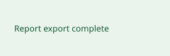

# Export a report

Run `report export --format json` in your project directory. A successful export writes `report.json` and returns exit code 0.

If the output directory is read-only, choose a writable folder and retry.
