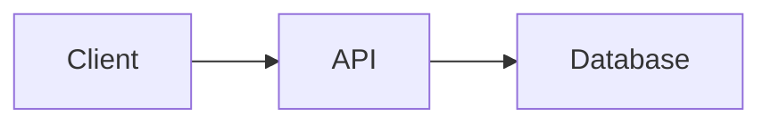

# Docusaurus authoring syntax

Use standard Markdown for most content.

## Admonitions

```markdown
:::note

Context the reader should remember.

:::

:::tip

A useful best practice.

:::

:::info

Neutral supporting information.

:::

:::caution

A risk the reader can avoid.

:::

:::danger

A destructive or critical consequence.

:::
```

Keep blank lines around the content and closing directive.

## Tabs

Use `.mdx` and import the built-in components:

````mdx
import Tabs from '@theme/Tabs';
import TabItem from '@theme/TabItem';

<Tabs>
  <TabItem value="npm" label="npm" default>

  ```bash
  npm install package
  ```

  </TabItem>
  <TabItem value="pnpm" label="pnpm">

  ```bash
  pnpm add package
  ```

  </TabItem>
</Tabs>
````

## Code blocks and details

Add the language and optional title to fenced code:

````markdown
```typescript title="src/example.ts"
export const ready = true
```
````

Use the standard HTML `<details>` and `<summary>` elements for disclosure when a
full Tabs component is unnecessary.

Never assume a custom React component exists. Inspect `src/components` and
existing imports before using one.

## Images and assets

Keep images under `static/img/` and reference them root-relative:

```markdown

```

## Diagrams

The scaffold enables `@docusaurus/theme-mermaid` with `markdown.mermaid: true`
in `docusaurus.config.js`, so a `mermaid` fence renders as a diagram:

````markdown

````

In an adopted project, confirm the theme is listed under `themes` before using
the fence; otherwise add it, since the build ignores the fence silently.
