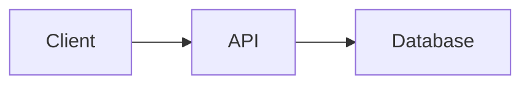

# Hugo authoring syntax

Use standard Goldmark Markdown for prose, headings, links, lists, tables, and
fenced code. Hugo has no built-in callout or tab syntax; the Doxloop scaffold
defines the shortcodes below under `layouts/shortcodes/`. A project that uses a
theme (Docsy, Hextra, Book, Relearn) ships its own shortcodes instead, so read
`layouts/shortcodes/` and the theme's `layouts/shortcodes/` before using any of
these and never invent a shortcode.

## Callouts

Scaffold shortcode `callout` with `type` of `note`, `tip`, `warning`, or
`danger` and an optional `title`:

```markdown

Restoring a snapshot replaces every record created after it.

```

Use `{}` (percent form) when the body needs Markdown rendered by
Hugo before the shortcode runs; the angle-bracket form above already passes
the body through `markdownify`.

## Tabs

Scaffold shortcodes `tabs` and `tab`. Mark one tab `default="true"`:

````markdown


```bash
npm install package
```


```bash
pnpm add package
```


````

## Code blocks

Always name the language. Hugo's Chroma highlighter accepts options after the
language:

````markdown
```yaml {linenos=true, hl_lines=["3-4"]}
server:
  port: 8080
```
````

## Images and assets

Put copied files under `static/` and reference them root-relative:

```markdown

```

Processed images belong under `assets/`; use them only through the project's
existing render hooks or partials.

## Diagrams

The scaffold renders `mermaid` fences through
`layouts/_default/_markup/render-codeblock-mermaid.html` and loads Mermaid
only on pages that contain one:

````markdown

````

A themed project needs the same render hook (or the theme's own Mermaid
support) before this fence renders; otherwise commit an SVG under `static/`.

## Front matter

Every page needs `title` and an outcome-focused `description`. Add `weight` to
order pages within a section, and `menu: { main: { weight: N } }` to place a
page in the main menu without editing `hugo.toml`.
