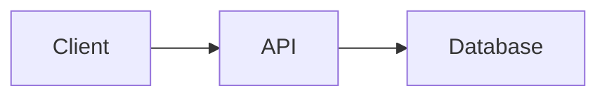

# Jekyll authoring syntax

Use kramdown Markdown for prose, headings, links, lists, tables, and fenced
code. Jekyll has no built-in callouts or tabs; the Doxloop scaffold provides
CSS classes and an include for them. A themed site (Just the Docs, Minimal
Mistakes, Chirpy) has its own conventions in its documentation and
`_includes/`; read those first and follow them instead.

## Callouts

Attach a kramdown block attribute list to a blockquote. Types are `note`
(default), `tip`, `warning`, and `danger`:

```markdown
> **Back up first.** Restoring a snapshot replaces every record created after it.
{: .callout .callout-warning }
```

The `_includes/callout.html` include produces the same markup when the body is
a single line:

```liquid

```

## Tabs

Use native disclosure elements so the page works without JavaScript. Add
`markdown="1"` so kramdown renders the Markdown inside:

````markdown
<details class="tab" open markdown="1">
<summary>npm</summary>

```bash
npm install package
```

</details>
<details class="tab" markdown="1">
<summary>pnpm</summary>

```bash
pnpm add package
```

</details>
````

## Code blocks

Name the language on every fence. Rouge highlights it at build time:

````markdown
```yaml
server:
  port: 8080
```
````

Escape Liquid in examples that contain `{{` or `{%` by wrapping the block in
`` and ``.

## Images and assets

Keep images under `assets/` and reference them root-relative:

```markdown

```

When the site sets a `baseurl`, pass the path through the `relative_url`
filter inside a Liquid expression instead of hard-coding the prefix.

## Diagrams

The scaffold layout upgrades `mermaid` fences to rendered diagrams on any page
that contains one:

````markdown

````

A themed site needs `jekyll-mermaid` or an equivalent script in its layout
before this fence renders; otherwise commit an SVG under `assets/`.

## Front matter

Every document needs `title` and an outcome-focused `description`. Keep
`permalink` stable once a page is published, and list new pages in the
`navigation` data (`_config.yml` or `_data/navigation.yml`) so the sidebar
shows them.
