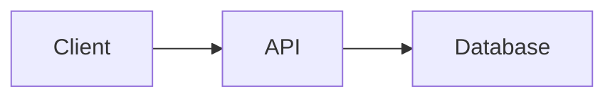

# Markdoc authoring syntax

Use CommonMark for prose, headings, links, lists, tables, and fenced code.
Markdoc adds tags written as `` … ``. Only tags declared
in `markdoc.config.mjs` exist; the build fails on an unknown tag or attribute.
The Doxloop scaffold declares the tags below. In an adopted project, read
`markdoc.config.mjs` and use only what it registers.

## Callouts

`callout` with `type` of `note` (default), `tip`, `warning`, or `danger` and
an optional `title`:

```markdown

Restoring a snapshot replaces every record created after it.

```

## Tabs

`tabs` containing `tab` entries. Each `tab` needs a `name`; mark one
`default=true`:

````markdown


```bash
npm install package
```


```bash
pnpm add package
```


````

## Code blocks

Name the language on every fence. The scaffold's fence node keeps it as a
`language-*` class for client-side highlighting:

````markdown
```yaml
server:
  port: 8080
```
````

## Images and assets

Keep images under `assets/` and reference them root-relative; the build copies
`assets/guides/` into `dist/assets/guides/`:

```markdown

```

## Diagrams

The scaffold's fence node turns a `mermaid` fence into a diagram and loads
Mermaid only on pages that contain one:

````markdown

````

## Variables and functions

Markdoc supports `` and functions such as ``.
Use them only when the project's build script supplies variables; the scaffold
does not.

## Front matter

Every page needs `title` and an outcome-focused `description`. Add every new
page to `navigation.json` with its `file`, `title`, `href`, and optional
`section`; the build renders only listed pages.
