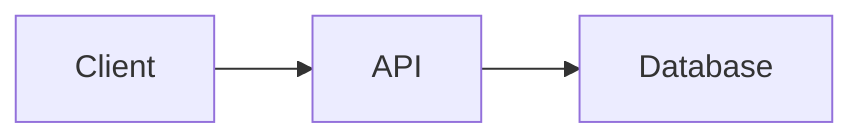

# MkDocs Material authoring syntax

Use standard Markdown for ordinary prose, headings, links, lists, tables, and
fenced code.

## Admonitions

Use four-space-indented content:

```markdown
!!! note

    Context the reader should remember.

!!! tip "Choose a descriptive title"

    A useful best practice.

!!! warning

    A risk the reader can avoid.

!!! danger

    A destructive or critical consequence.
```

Use `???` for collapsed details and `???+` for initially expanded details:

```markdown
??? note "See the generated configuration"

    Keep optional detail here.
```

## Content tabs

Use the configured `pymdownx.tabbed` extension:

````markdown
=== "npm"

    ```bash
    npm install package
    ```

=== "pnpm"

    ```bash
    pnpm add package
    ```
````

Keep four spaces before every line nested under a tab.

## Code blocks

Add a language to every fenced block. Use an optional title through attributes:

````markdown
```typescript title="src/example.ts"
export const ready = true
```
````

Do not use Docusaurus code-block attributes outside syntax supported by the
configured `pymdownx.superfences` version.

## Buttons and attributes

Use attributes sparingly when they improve a primary action:

```markdown
[Open the dashboard](https://app.example.com){ .md-button .md-button--primary }
```

Never use visual button styling for ordinary navigation links.

## Images and assets

Keep images inside the docs directory (for example `docs/assets/`) and use
relative links:

```markdown

```

## Diagrams

The scaffold registers a `mermaid` custom fence under `pymdownx.superfences`,
and Material renders it as a diagram:

````markdown

````

In an adopted project, confirm `mkdocs.yml` carries the `custom_fences` entry
for `mermaid` before using the fence.
