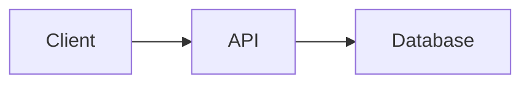

# Nextra authoring syntax

Use standard Markdown in `.mdx` pages. Nextra 4 ships components in
`nextra/components`; import each one explicitly at the top of the page.

## Callouts

GitHub-style alerts need no import:

```markdown
> [!NOTE]
> Context the reader should remember.

> [!WARNING]
> A risk the reader can avoid.
```

Use the `Callout` component for a custom emoji or the `error` type:

```mdx
import { Callout } from 'nextra/components'

<Callout type="warning" emoji="⚠️">
  Restoring a snapshot replaces every record created after it.
</Callout>
```

Types are `default`, `info`, `warning`, and `error`.

## Tabs

```mdx
import { Tabs } from 'nextra/components'

<Tabs items={['npm', 'pnpm']}>
  <Tabs.Tab>
    ```bash
    npm install package
    ```
  </Tabs.Tab>
  <Tabs.Tab>
    ```bash
    pnpm add package
    ```
  </Tabs.Tab>
</Tabs>
```

Add `storageKey="package-manager"` to keep the same tab selected across pages.

## Steps

```mdx
import { Steps } from 'nextra/components'

<Steps>
### Install the CLI

### Sign in

### Run the first sync
</Steps>
```

## Code blocks

Name the language and add a `filename` when the reader edits a file:

````markdown
```yaml filename="config.yaml"
server:
  port: 8080
```
````

Highlight lines with `{3-4}` after the language.

## Images and assets

Keep images under `public/` and reference them root-relative:

```markdown

```

## Diagrams

Nextra renders `mermaid` fences without extra configuration:

````markdown

````

## Front matter and navigation

Every page needs `title` and an outcome-focused `description`. Nextra lists
every file in `content/` automatically; `_meta.js` in each directory sets
order and labels, and every key in it must match a page or folder beside it.
